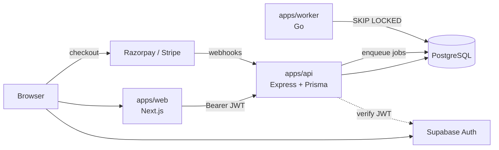
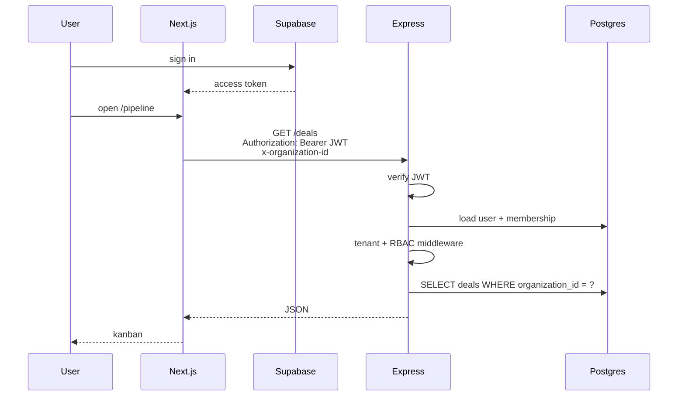
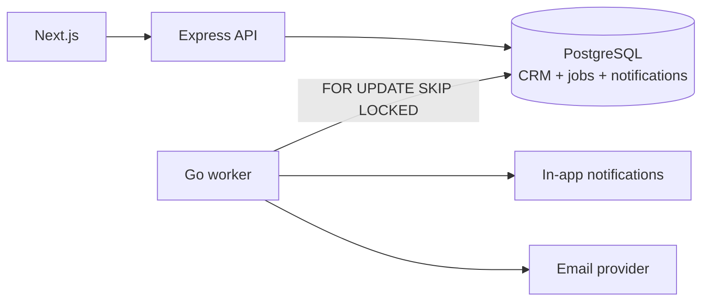
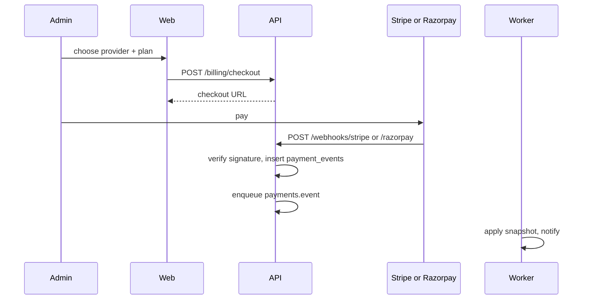
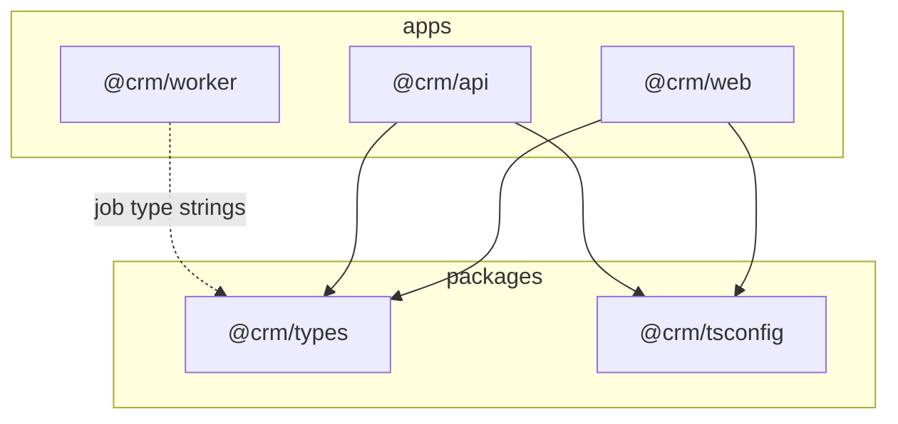
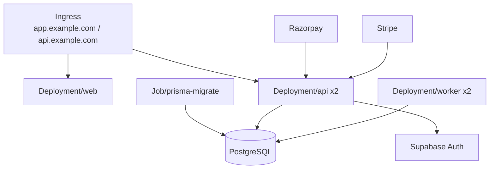

# High-level architecture

Company CRM is a **pnpm + Turborepo monorepo**. The browser never talks to PostgreSQL. Next.js owns the UI and Supabase session. Express owns tenancy, RBAC, and writes. A Go worker owns anything that can retry.

## System



| Process | Lives in | Does | Does not |
|---|---|---|---|
| Web | `apps/web` | Pages, Supabase sign-in, call the API | Hold secrets, query Postgres, verify webhooks |
| API | `apps/api` | REST, JWT verify, `organization_id` scope, Prisma writes, enqueue jobs, start checkout | Render UI, send email, reconcile payments |
| Worker | `apps/worker` | Email, notification fan-out, payment reconcile/dunning, rollups, reminders, job retries | Serve product HTTP |
| Auth | Supabase | Passwords, sessions, reset, later SSO | Store CRM records |
| Payments | Razorpay + Stripe | Collect money | Be the source of truth for plan status — that is Postgres |

## Request path



Process probes:

- `GET /health` — API process is up (Kubernetes liveness). No database call.
- `GET /ready` — PostgreSQL accepts a ping (Kubernetes readiness).

Hard rules:

1. Every business row has `organization_id`. Middleware sets it; queries do not take it from the body as the only check.
2. Roles (`ADMIN` / `MANAGER` / `MEMBER`) are enforced in Express, not only in the UI.
3. No `password_hash` in this database. `users.id` is the Supabase `auth.users.id`. See [docs/ERD.md](./docs/ERD.md).

## Jobs

The API stays request/response. It inserts a `jobs` row in the **same transaction** as the CRM write; the Go worker claims it later.



See [docs/JOBS.md](./docs/JOBS.md), [docs/WORKER.md](./docs/WORKER.md), [docs/NOTIFICATIONS.md](./docs/NOTIFICATIONS.md), [docs/RELIABILITY.md](./docs/RELIABILITY.md).

Job type names are shared between `@crm/types` (`JobType`) and `apps/worker/internal/jobs`. Keep them in lockstep.

| Type | When |
|---|---|
| `email.invite` / `email.receipt` / `email.follow_up` | Outbound mail |
| `notification.fanout` | In-app notification (typed payload) |
| `payments.reconcile` | After a verified Razorpay or Stripe webhook |
| `payments.dunning` | Failed renewal |
| `analytics.rollup` | Dashboard aggregates |
| `deals.flag_stale` | Stage SLA |
| `tasks.remind` | Upcoming and overdue task reminders |

## Payments

Organization billing. Provider adapters live under `apps/api/src/lib/payments`. Web and CRM modules never import Stripe/Razorpay SDKs. Docs: `docs/BILLING.md`, `docs/STRIPE.md`, `docs/RAZORPAY.md`, `docs/WEBHOOKS.md`.

One org has at most one **open** provider subscription (partial unique index). India / INR can use Razorpay; international cards Stripe. Both write `subscriptions`, `invoices`, and `payment_events`.



Webhook routes are unauthenticated but **signature-verified** with the raw body. Checkout routes are `ADMIN` only. A checkout redirect is not proof of payment.

## Deals, pipeline, and Kanban

CRM opportunities are **`Deal`** rows scoped by `organization_id`, tied to a **`Pipeline`** and **`PipelineStage`**. Org onboarding seeds a default **Sales Pipeline** with ordered stages (Lead → … → Won/Lost) and default stage probabilities in `@crm/types`.

| Layer | Location | Responsibility |
|---|---|---|
| API | `apps/api/src/modules/deals/deal.service.ts` | CRUD, search/filter/sort, owner assignment, probability rules (`STAGE_DEFAULT` vs `MANUAL`), transactional stage moves with `SELECT … FOR UPDATE`, immutable `DealStageHistory`, activities, audit; enqueue `notification.fanout` in the same transaction |
| API | `apps/api/src/modules/pipelines/pipeline-board.service.ts` | `GET …/kanban` and `GET …/summary` with tenant + owner visibility, SQL windowed cards, and weighted aggregates |
| Worker | `apps/worker/internal/notifications` | Creates in-app notifications from `notification.fanout` jobs (unique `dedupe_key`, active-member check) |
| Web | `apps/web/app/(app)/pipeline`, `components/deals/*` | Kanban (dnd-kit), URL-backed filters, Lost/Won dialogs, optimistic drag with rollback, deal list/detail/create/edit |

Stage changes **must** use `POST /api/v1/deals/:id/stage` (or `PATCH /:id/stage`), not generic deal PATCH. Lost requires a reason; Won/Lost timestamps clear on reopen. Each successful stage change also writes an immutable `STATUS_CHANGE` activity in the same transaction. See [docs/DEALS.md](./docs/DEALS.md), [docs/PIPELINE.md](./docs/PIPELINE.md), [docs/KANBAN.md](./docs/KANBAN.md).

## Activities, tasks, and reminders

Activities record what happened. Tasks record what needs to happen. They share company/contact/deal relations and stay separate from `audit_logs`.

| Layer | Location | Responsibility |
|---|---|---|
| API | `apps/api/src/modules/activities` | Tenant-scoped CRUD, search, follow-up-in-transaction, immutable `STATUS_CHANGE` |
| API | `apps/api/src/modules/tasks` | CRUD, complete/reopen/assign, derived `isOverdue`, SQL overdue filter |
| API | `apps/api/src/modules/tasks/task-reminders.service.ts` | Testable reminder/overdue sweep using unique `notifications.dedupe_key` |
| Worker | `apps/worker/internal/tasks` | Production sweep on `tasks.remind` jobs and a ticker; `ON CONFLICT (dedupe_key) DO NOTHING` |
| Web | `apps/web/components/followups/*`, `components/notifications/*` | Timeline, task cards, notification bell/page |

Upcoming reminders use `TASK_REMINDER:{taskId}:{due ISO}`. Daily overdue notices use `TASK_OVERDUE:{taskId}:{YYYY-MM-DD}`. The reminder window is `TASK_REMINDER_HOURS` (default 24). See [docs/ACTIVITIES.md](./docs/ACTIVITIES.md), [docs/TASKS.md](./docs/TASKS.md), [docs/FOLLOW_UPS.md](./docs/FOLLOW_UPS.md).

## Dashboard and analytics

The UI never aggregates CRM lists. Express runs tenant-scoped SQL (`COUNT`/`SUM`/`GROUP BY`) and returns small JSON. Organization id comes from membership middleware. MEMBER `analytics.read` is own-record only; `analytics.team` gates the leaderboard and department filter.

| Layer | Location | Responsibility |
|---|---|---|
| API | `apps/api/src/modules/analytics` | Overview, pipeline, revenue, win-rate, leaderboard; date bounds in org timezone |
| Web | `apps/web/app/(app)/dashboard`, `analytics`, `components/analytics/*` | KPI cards, CSS charts, URL filters |

See [docs/ANALYTICS.md](./docs/ANALYTICS.md) and [docs/DASHBOARD.md](./docs/DASHBOARD.md). `analytics.rollup` remains a reserved job type; this milestone does not materialize rollup tables.

## Monorepo

```
CRM/
├── apps/
│   ├── web/          # Next.js App Router — UI only
│   ├── api/          # Express + Prisma — system of record
│   └── worker/       # Go — async consumers
├── packages/
│   ├── types/        # Shared TS contracts (roles, jobs, errors)
│   └── tsconfig/     # Shared compiler settings
├── deploy/
│   ├── docker-compose.yml
│   └── k8s/
├── ARCHITECTURE.md
└── README.md         # PRD roadmap
```



Add a new CRM feature in this order: Prisma model → Express module under `apps/api/src/modules/` → types in `packages/types` if the web needs them → Next.js route → enqueue a job only if the work is slow or retryable.

## Deploy

**Local:** Postgres from Compose; Next, Express, and the worker on the host via Turborepo.

```bash
cp .env.example .env
docker compose -f deploy/docker-compose.yml up postgres
pnpm install
pnpm db:push
pnpm dev
```

**Full images locally:** `docker compose -f deploy/docker-compose.yml --profile stack up --build`

**Production:** three Deployments behind Ingress. Prisma migrate is a Job that must succeed before new API replicas take traffic. Postgres in-cluster is for staging; production should use managed Postgres (or Supabase Postgres). Supabase is always Auth, even if the app DB is separate.



Secrets (`DATABASE_URL`, Supabase JWT, Razorpay, Stripe) live in `deploy/k8s/secrets.yaml` as a template only. Use a secret manager in a real cluster.

## Boundaries that keep this from rotting

- **Web → API only.** No Prisma in Next.js. No service-role Supabase key in the browser.
- **API → worker via the `jobs` table.** Do not call the worker over HTTP for MVP.
- **Worker is idempotent on `dedupe_key` / webhook `event_id`.** Replays must not double-notify or double-charge. Email is at-least-once.
- **One pipeline per org in v1.** Deals move through stages; “Lead” is the first stage, not a second entity.
- **Both payment providers stay behind one module.** UI picks a provider; the rest of the app reads `subscriptions.status`.
