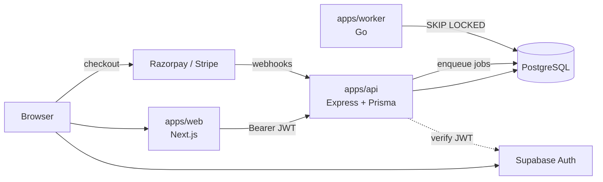
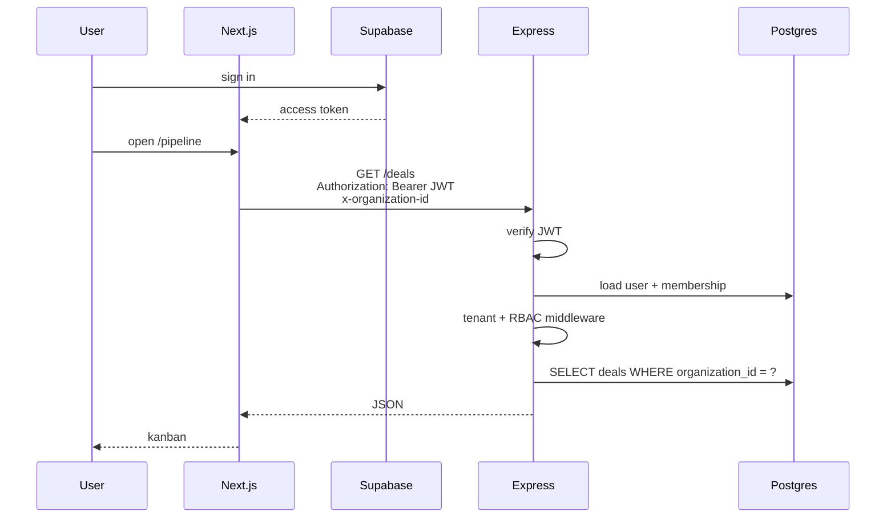
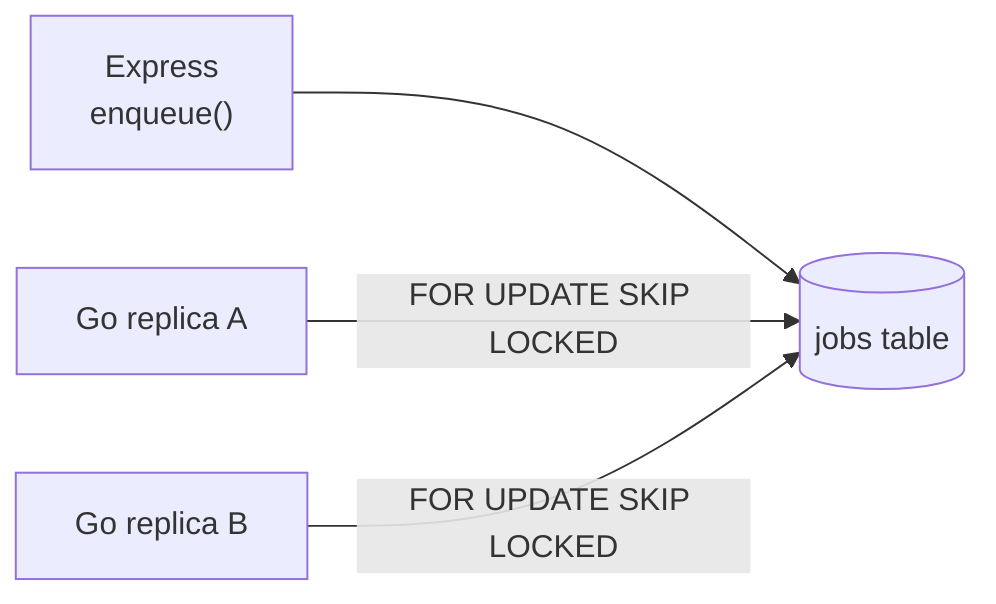
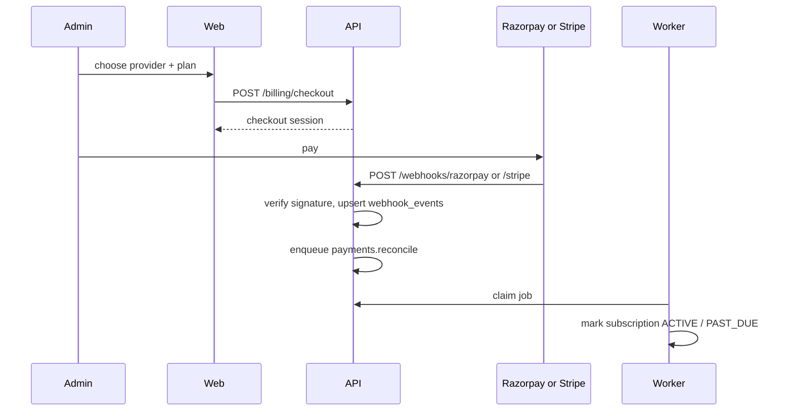
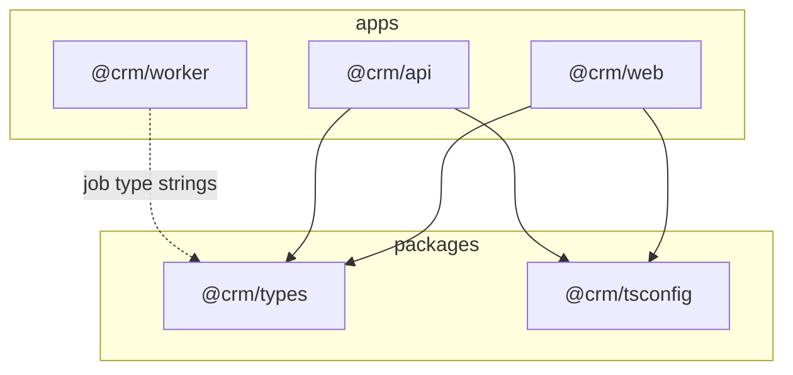
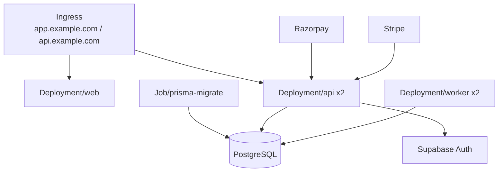

# High-level architecture

Company CRM is a **pnpm + Turborepo monorepo**. The browser never talks to PostgreSQL. Next.js owns the UI and Supabase session. Express owns tenancy, RBAC, and writes. A Go worker owns anything that can retry.

## System



| Process | Lives in | Does | Does not |
|---|---|---|---|
| Web | `apps/web` | Pages, Supabase sign-in, call the API | Hold secrets, query Postgres, verify webhooks |
| API | `apps/api` | REST, JWT verify, `organization_id` scope, Prisma writes, enqueue jobs, start checkout | Render UI, send email, reconcile payments |
| Worker | `apps/worker` | Email, notification fan-out, payment reconcile/dunning, rollups, reminders | Serve HTTP to users |
| Auth | Supabase | Passwords, sessions, reset, later SSO | Store CRM records |
| Payments | Razorpay + Stripe | Collect money | Be the source of truth for plan status — that is Postgres |

## Request path



Process probes:

- `GET /health` — API process is up (Kubernetes liveness). No database call.
- `GET /ready` — PostgreSQL accepts a ping (Kubernetes readiness).

Hard rules:

1. Every business row has `organization_id`. Middleware sets it; queries do not take it from the body as the only check.
2. Roles (`ADMIN` / `MANAGER` / `MEMBER`) are enforced in Express, not only in the UI.
3. No `password_hash` in this database. `users.supabase_user_id` is the link to Supabase.

## Jobs

The API stays request/response. It inserts a `jobs` row; the worker claims it.



Job type names are shared in spirit between `@crm/types` (`JobType`) and `apps/worker/internal/jobs`. Keep them in lockstep.

| Type | When |
|---|---|
| `email.invite` / `email.receipt` / `email.follow_up` | Outbound mail |
| `notification.fanout` | In-app notification to one or more users |
| `payments.reconcile` | After a verified Razorpay or Stripe webhook |
| `payments.dunning` | Failed renewal |
| `analytics.rollup` | Dashboard aggregates |
| `deals.flag_stale` | Stage SLA |
| `tasks.remind` | Overdue follow-ups |

## Payments

One org has at most one active provider subscription. India / INR → Razorpay. International cards → Stripe. Both write `subscriptions`, `invoices`, and `webhook_events`.



Webhook routes are unauthenticated but **signature-verified**. Checkout routes are `ADMIN` only.

## Monorepo

```
CRM/
├── apps/
│   ├── web/          # Next.js App Router — UI only
│   ├── api/          # Express + Prisma — system of record
│   └── worker/       # Go — async consumers
├── packages/
│   ├── types/        # Shared TS contracts (roles, jobs, errors)
│   └── tsconfig/     # Shared compiler settings
├── deploy/
│   ├── docker-compose.yml
│   └── k8s/
├── ARCHITECTURE.md
└── README.md         # PRD roadmap
```



Add a new CRM feature in this order: Prisma model → Express module under `apps/api/src/modules/` → types in `packages/types` if the web needs them → Next.js route → enqueue a job only if the work is slow or retryable.

## Deploy

**Local:** Postgres from Compose; Next, Express, and the worker on the host via Turborepo.

```bash
cp .env.example .env
docker compose -f deploy/docker-compose.yml up postgres
pnpm install
pnpm db:push
pnpm dev
```

**Full images locally:** `docker compose -f deploy/docker-compose.yml --profile stack up --build`

**Production:** three Deployments behind Ingress. Prisma migrate is a Job that must succeed before new API replicas take traffic. Postgres in-cluster is for staging; production should use managed Postgres (or Supabase Postgres). Supabase is always Auth, even if the app DB is separate.



Secrets (`DATABASE_URL`, Supabase JWT, Razorpay, Stripe) live in `deploy/k8s/secrets.yaml` as a template only. Use a secret manager in a real cluster.

## Boundaries that keep this from rotting

- **Web → API only.** No Prisma in Next.js. No service-role Supabase key in the browser.
- **API → worker via the `jobs` table.** Do not call the worker over HTTP for MVP.
- **Worker is idempotent on `job_id` / webhook `event_id`.** Replays must not double-charge or double-email.
- **One pipeline per org in v1.** Deals move through stages; “Lead” is the first stage, not a second entity.
- **Both payment providers stay behind one module.** UI picks a provider; the rest of the app reads `subscriptions.status`.
