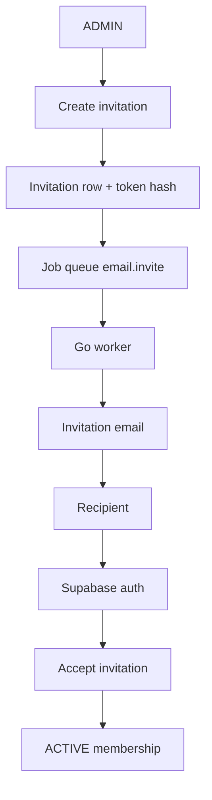

# Team management

Customer organizations have three roles: `ADMIN`, `MANAGER`, `MEMBER`. Membership is unique per `(organization_id, user_id)`.

## Membership lifecycle

1. Invitation created by a user with `users.invite`.
2. Recipient authenticates with the invited email.
3. `POST /api/v1/team/invitations/:token/accept` creates or reactivates membership as `ACTIVE`.
4. `users.update` can change role/department.
5. `users.deactivate` sets `DEACTIVATED`. Historical CRM rows stay owned by that user.
6. Reactivation restores `ACTIVE`.

Pending email invites live in `organization_invitations`, not as `INVITED` memberships.

## Role management

Only `users.update` (ADMIN) can change roles. The last ACTIVE ADMIN cannot be demoted or deactivated (`LAST_ADMIN_REQUIRED`). Users cannot change their own role when another ADMIN exists.

Department uses the existing enum: `SALES`, `MARKETING`, `MANAGEMENT`, `OTHER`.

## Ownership transfer

`POST /api/v1/organizations/current/transfer-ownership` with `{ memberId }` requires `organization.update`. The target becomes ADMIN and the actor becomes MANAGER in one transaction, so the org never has zero admins.

## Deactivation

Does not delete the Supabase user, local user, or CRM records. Tenant middleware only attaches `ACTIVE` memberships, so a deactivated user cannot call org APIs.

## Audit events

| Action | When |
|---|---|
| `USER_INVITED` | Invitation created |
| `INVITATION_RESENT` | Resend |
| `INVITATION_CANCELLED` | Cancel |
| `MEMBER_JOINED` | Accept |
| `USER_ROLE_CHANGED` | Role change |
| `MEMBER_DEPARTMENT_CHANGED` | Department change |
| `USER_DEACTIVATED` / `USER_REACTIVATED` | Status change |
| `OWNERSHIP_TRANSFERRED` | Ownership transfer |
| `ORGANIZATION_UPDATED` | Settings update |

## API

| Method | Path | Permission |
|---|---|---|
| GET | `/api/v1/organizations/current` | `organization.read` |
| PATCH | `/api/v1/organizations/current` | `organization.update` |
| POST | `/api/v1/organizations/current/transfer-ownership` | `organization.update` |
| GET | `/api/v1/team` | `users.read` |
| GET | `/api/v1/team/:memberId` | `users.read` |
| GET | `/api/v1/team/:memberId/activity` | `users.read` |
| PATCH | `/api/v1/team/:memberId` | `users.update` |
| POST | `/api/v1/team/:memberId/deactivate` | `users.deactivate` |
| POST | `/api/v1/team/:memberId/reactivate` | `users.update` |
| POST | `/api/v1/team/invitations` | `users.invite` |
| GET | `/api/v1/team/invitations` | `users.invite` |
| POST | `/api/v1/team/invitations/:id/resend` | `users.invite` |
| POST | `/api/v1/team/invitations/:id/cancel` | `users.invite` |
| GET | `/api/v1/team/invitations/:token` | public |
| POST | `/api/v1/team/invitations/:token/accept` | authenticated |

Tenant id, inviter, and actor always come from the JWT + ACTIVE membership. Clients cannot set `organization_id`, `invited_by`, or `user_id`.
